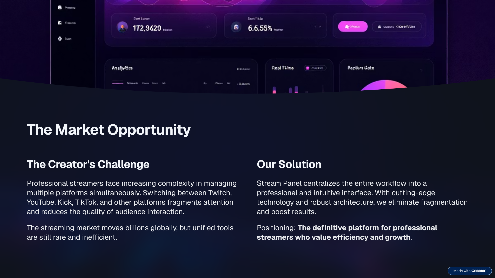
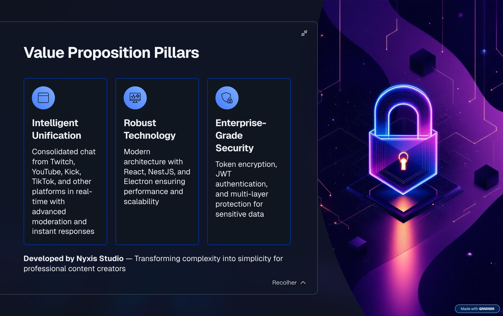
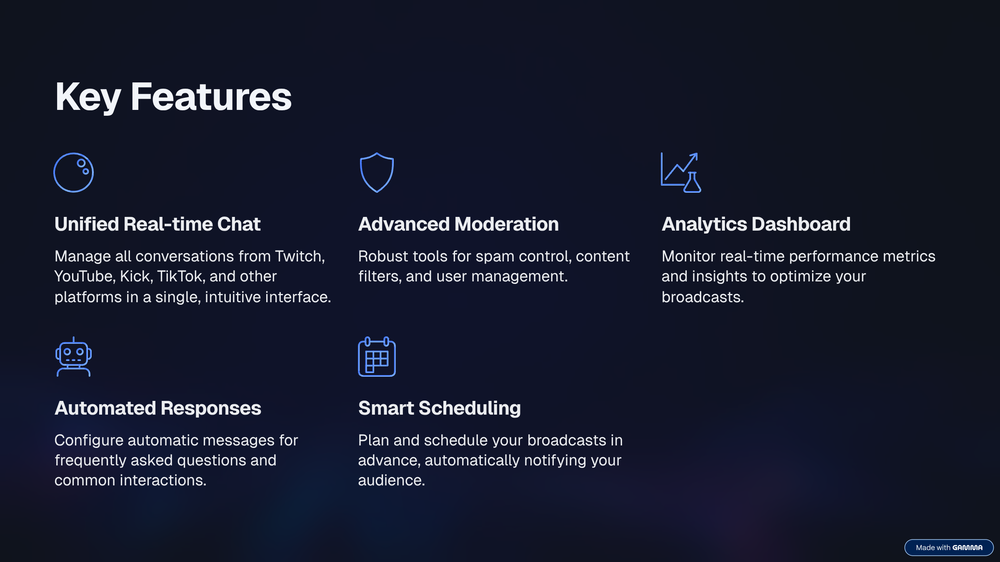
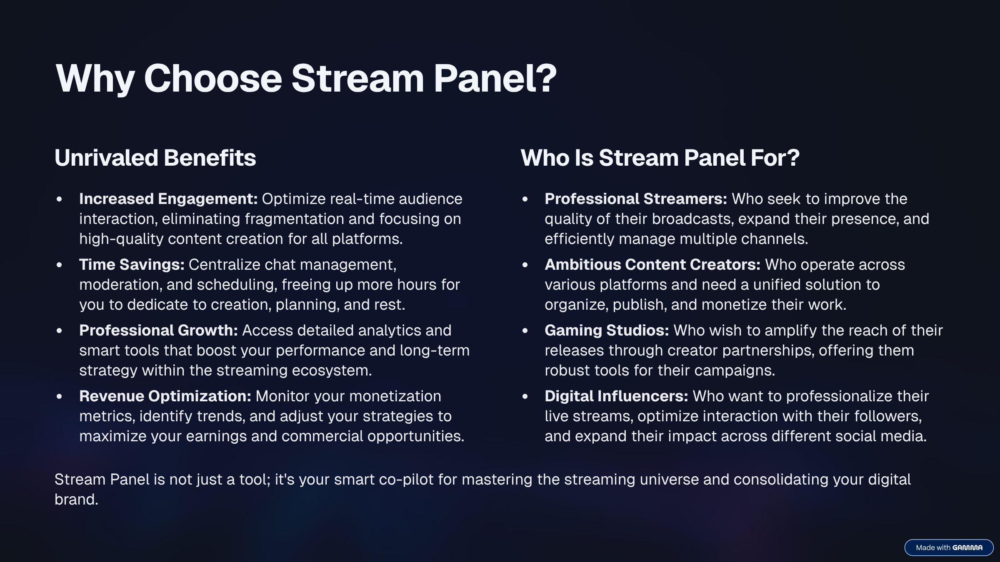
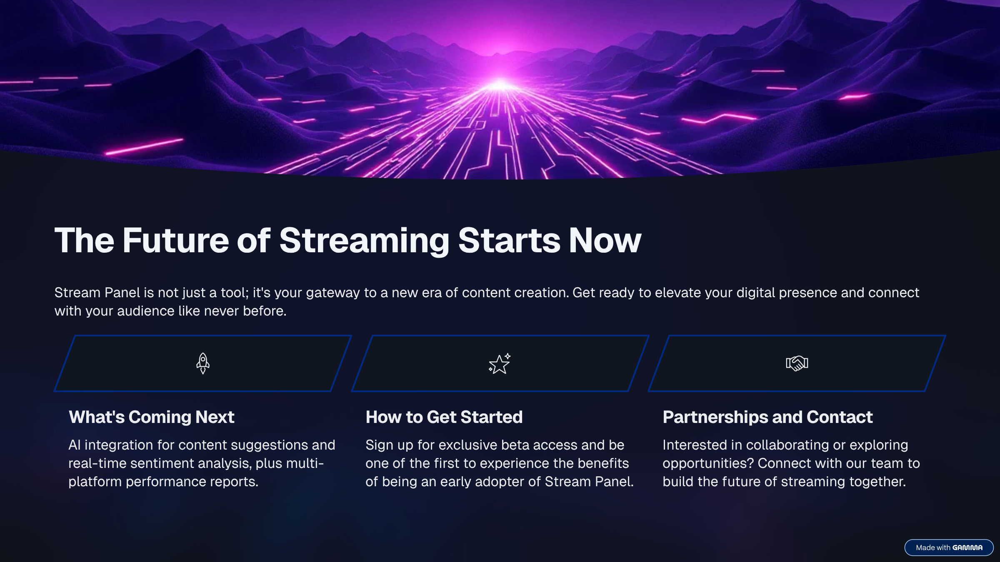

[Português](README.pt-BR.md)

# Stream Panel - Coming soon 

  
  <h3>Unified Creator Control Center</h3>
  
A professional desktop workspace to manage chat, events, and stream operations across multiple platforms.

  

---

## Overview

**Stream Panel** is a desktop application that centralizes the operational workflow of streamers and content creators:
**unified chat**, **activity feeds**, **stream metadata controls**, and a scalable foundation for **multi-platform integrations**
(Twitch, YouTube, Kick, TikTok).

Built with a **real-time** and **modular** architecture, features ship as independent panels while maintaining a consistent UX.

---

## Product Narrative

  

  

---

## Key Capabilities

  

- **Unified Chat**: read, filter, and moderate messages across supported platforms.
- **Activity Feed**: normalized events (follows, subs, redeems, alerts) presented in a consistent stream.
- **Moderation Toolkit**: spam controls, content filters, user actions, and operational shortcuts.
- **Analytics Surfaces**: real-time metrics and dashboards designed for creator decisions.

---

## Why Stream Panel

  

Stream Panel focuses on **operational clarity**, **low-latency feedback**, and **scalable modularity**—so new capabilities are panels, not rewrites.

---

## Technology (High-level)

- **Electron**: desktop runtime and lifecycle
- **React + TypeScript**: UI layer and modular panels
- **NestJS**: integrations, APIs, and real-time gateways
- **PostgreSQL + Prisma**: persistence and audit-friendly state

---

## Forward Vision

  

---

  

  
  Developed by Nyxis Studio • Stream Panel

