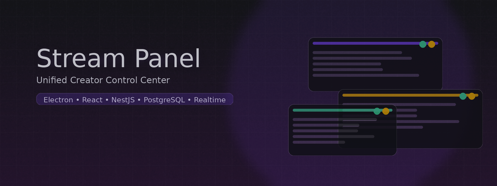
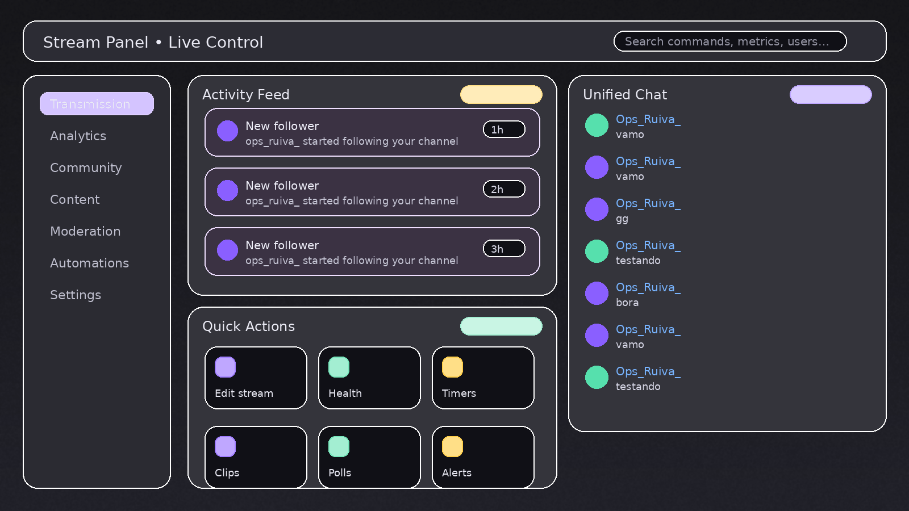
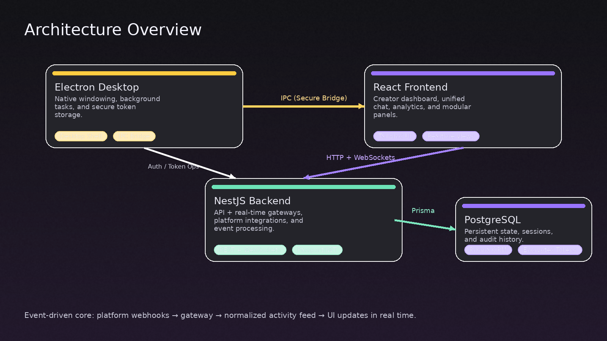

# Stream Panel

  
  <h3>Unified Creator Control Center</h3>
  
One professional desktop workspace to manage chat, events, and stream operations across multiple platforms.

  

---

## What is Stream Panel?

**Stream Panel** is a desktop application designed to centralize a creator’s operational workflow: **unified chat**, **activity feed**, **stream metadata controls**, and a scalable foundation for **multi-platform integrations** (Twitch, YouTube, Kick, TikTok).

The project is engineered around a **real-time** and **modular** architecture, enabling features to ship as independent panels while maintaining a consistent UX.

  

---

## Core Capabilities

- **Unified Chat**: one surface to read, filter, and moderate messages across supported platforms.
- **Activity Feed**: normalized events (follows, subs, redeems, alerts) displayed as a consistent stream.
- **Creator Controls**: edit stream title/category and execute operational actions through quick commands.
- **Panel-first UX**: a scalable layout where features are built as composable modules.

---

## Technical Architecture

Stream Panel follows a clean separation of concerns across three layers:

- **Desktop Shell (Electron)**: windowing, native behaviors, secure bridges, and desktop lifecycle.
- **UI (React)**: fast iteration on panels and views using a modern component-driven approach.
- **Backend (NestJS)**: integrations, event normalization, and real-time delivery via WebSockets.

  

---

## Technology Stack

### Frontend
- **React 18 + TypeScript**
- **Vite** for fast builds and DX
- **Tailwind CSS** for a cohesive design system
- **Socket.io Client** for real-time updates

### Backend
- **NestJS** for a structured, scalable API layer
- **Socket.io Gateway** for low-latency event streaming
- **Prisma ORM** for predictable persistence
- **PostgreSQL** as the system of record

### Desktop
- **Electron** as the desktop runtime
- **Secure IPC** patterns for frontend ↔ desktop operations

---

## Design Principles

- **Operational clarity**: creator-critical information is always visible, prioritized by urgency.
- **Low-latency feedback**: actions reflect instantly through real-time event propagation.
- **Scalable modularity**: new features should be panels, not rewrites.
- **Professional UI**: consistent spacing, typography, and color semantics for rapid navigation.

---

## Project Direction

Stream Panel is built to evolve into a full **creator operations platform**, including:

- Deeper **moderation** workflows
- **Multi-account** and multi-channel management
- **Automation** and rule-based actions (alerts, triggers, workflows)
- Expansion of **multi-platform** coverage and normalization

---

  Developed by Nyxis Studio • Stream Panel

