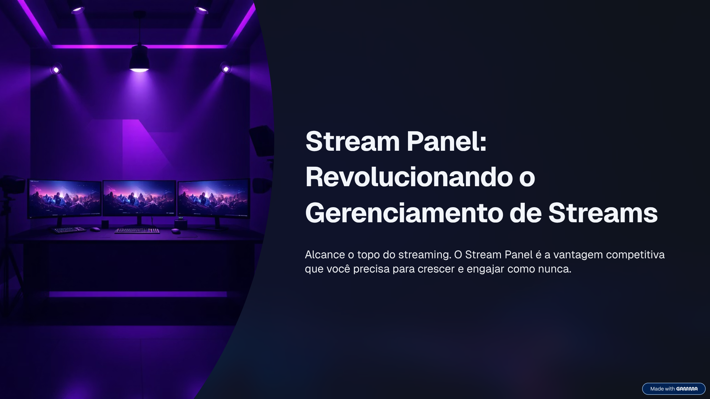
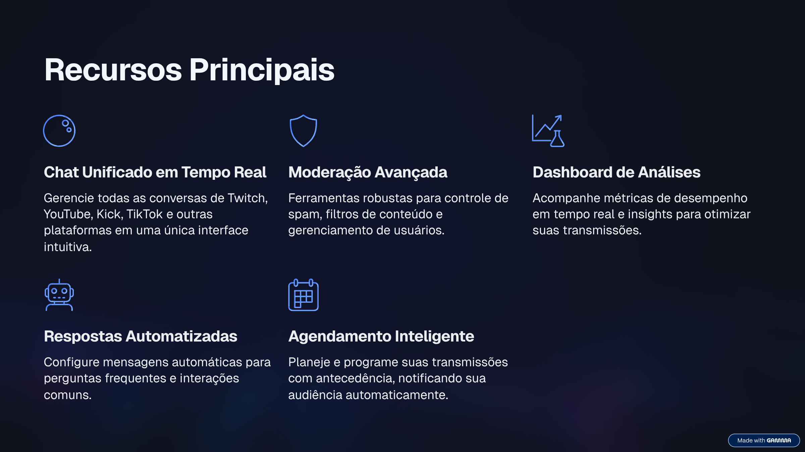
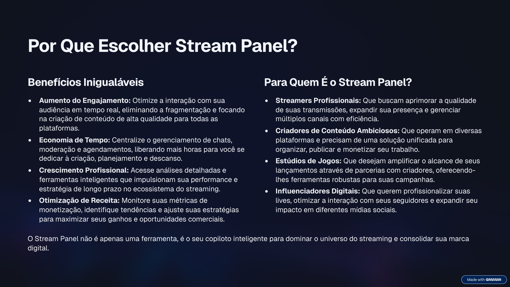
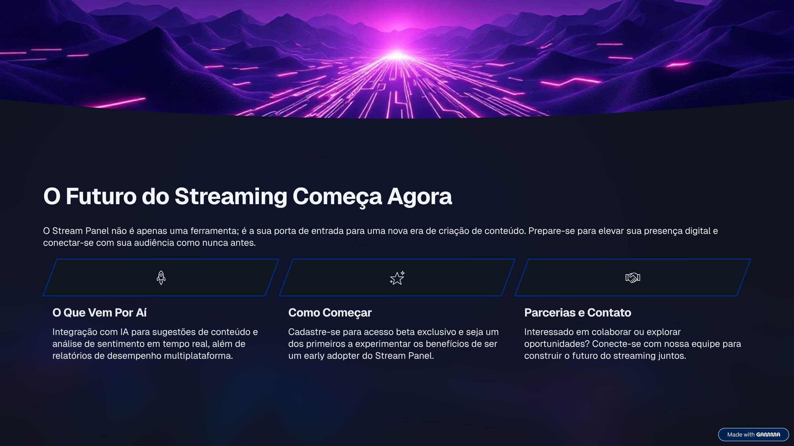

# Stream Panel -  

  
    

    
  

  <h3>Central de Controle Unificada para Criadores</h3>
  
Um workspace desktop profissional para gerenciar chat, eventos e operações da live em múltiplas plataformas.

  

---

## Visão Geral

O **Stream Panel** é uma aplicação desktop criada para centralizar o fluxo operacional de streamers e criadores:
**chat unificado**, **feed de atividades**, **controles da transmissão** e uma base escalável para **integrações multi-plataforma**
(Twitch, YouTube, Kick, TikTok).

O projeto é construído com uma arquitetura **em tempo real** e **modular**, permitindo que novos recursos sejam entregues como painéis.

---

## Narrativa do Produto

  

  

---

## Capacidades Principais

  

- **Chat Unificado**: leitura, filtros e moderação em múltiplas plataformas.
- **Feed de Atividades**: eventos normalizados (follow, sub, resgates, alertas) em um fluxo consistente.
- **Kit de Moderação**: controle de spam, filtros de conteúdo, ações por usuário e atalhos operacionais.
- **Superfícies de Analytics**: métricas e dashboards em tempo real para decisão do criador.

---

## Por que Stream Panel

  

O Stream Panel foca em **clareza operacional**, **feedback de baixa latência** e **modularidade escalável**—para que novas funcionalidades sejam painéis, não reescritas.

---

## Tecnologia (Visão de Alto Nível)

- **Electron**: runtime desktop e ciclo de vida
- **React + TypeScript**: UI e painéis modulares
- **NestJS**: integrações, APIs e gateways em tempo real
- **PostgreSQL + Prisma**: persistência e estado com trilha de auditoria

---

## Visão de Futuro

  

---

  
  Desenvolvido pela Nyxis Studio • Stream Panel

